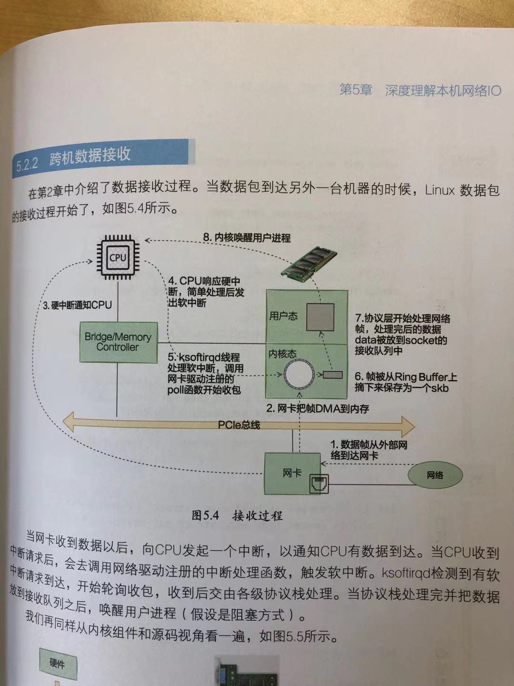
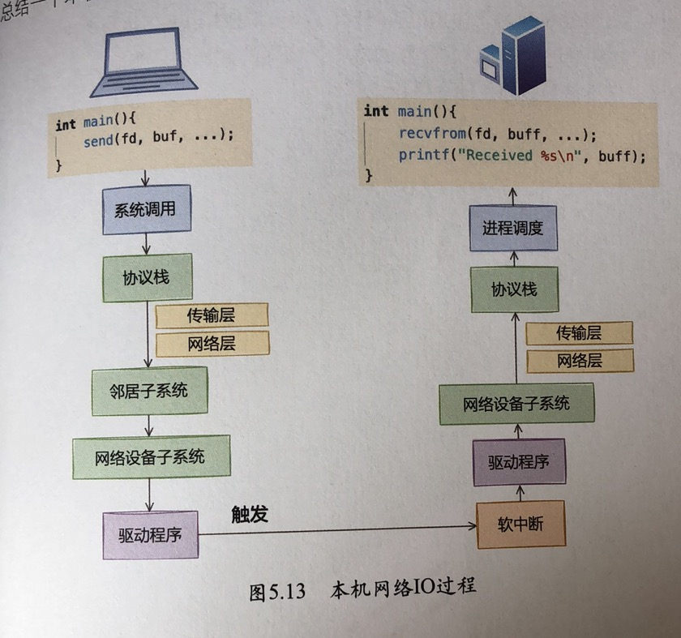

# linux接收和发送数据包的过程

## Linux的网络分层结构
* 

## Linux网卡接收数据的过程
```
网卡收到数据  ->
由网卡的DMA控制器将数据拷贝到内核的内存RingBuffer中 ->
向CPU发起硬中断通知 ->
内核态, 驱动，链路层：CPU执行中断处理的上半部分，然后发出软中断 ->
内核态, 驱动，链路层：内核线程 ksofiirq处理软中断, 通过网卡驱动注册的poll函数收数据 ->
内核态, 驱动，链路层：数据被从RingBuffer上拷贝到内核内存管理的SKB中->
内核态, 协议栈，网络和数据层：通过协议栈处理将数据放在内核态的socket接受队列 ->
唤醒用户进程，用户态获取到数据
```




## Linux发送数据的过程
```
发送数据涉及到的拷贝
1. 用户需要发送的数据拷贝到内核skb
2. 传输层进入网络层 进行一次skb拷贝，原因是为了丢包重传使用
3. 网络层如果发现数据包大于MTU，会拷贝成小的skb
```


## Linux发送数据零拷贝的过程
```
发送数据的零拷贝省略的是上面第一步拷贝，可以用sendfile或者mmap来完成零拷贝
```


## 跨机通信和本机通信
```
用lo通信和用本地ip通信是一样的

本地通信比跨机通信
发送方少了 驱动中不需要进RingBuffer，少了一个发送完成的硬件中断
接收方少了 驱动中进入RingBuffer，少了一个网卡接收到数据的硬件中断
```



## socket连接
```
全队列：完成三次握手等待accept的连接，最大长度为listen时传入的backlog和net.core.somaxconn之间的最小值，
半队列：已发起三次握手，但是未完成三次握手的连接，最大长度为 min(backlog, somaxconn, tcp_max_syn_backlog) + 1 再上取整到2的N次幂，但是不能小于16，

在握手的第一个syn包如果半连接或者全连接队列满，且ipv4.tcp_syncookies为0,则服务端会将握手包被丢弃
在握手的最后一个ack包如果全连接队列满，则服务端会将该包丢弃

连接异常
1. 排查端口是否充足，ip_local_port_range内核参数，time_wait是否占用端口四元组过多
2. 全队列和半队列是否已满,客户端在服务器丢syn包时，会使用net.ipv4.tcp_syn_retries进行叠加时间重试，要小心
方法：
1. 打开ipv4.tcp_syncookies,SYNcookie就是将连接信息编码在ISN(initialsequencenumber)中返回给客户端，这时server不需要将半连接保存在队列中，而是利用客户端随后发来的ACK带回的ISN还原连接信息，以完成连接的建立，避免了半连接队列被攻击SYN包填满。
2. 加大全链接和半连接的长度
3. 尽快完成accept
4. 尽早拒绝，tcp_abort_on_overflow会在队列满时，直接发送rest给客户端，而不是丢包

查看连接队列溢出情况
全队列溢出
    watch 'netstat -s | grep overflowed'
半队列溢出，不是很好看，直接看ipv4.tcp_syncookies有没有设置
    netstat -s | grep SYNCs 这条命令显示的syn丢失包括全队列/半队列/握手错误都会增加该值，不能准确表示是由于半队列导致
可以通过手动计算当前的半队列长队，再结合 netstat -antp  |grep SYN_RECV | wc -l 来判断
我建议可以这样
1. netstat -s | grep SYNCs 发现有syn丢包，可能是 全队列/半队列/握手错误导致
2. netstat -s | grep overflowed 判断是不是全队列满导致的
3. 排除全队列满的情况下，一般就是半队列满和ipv4.tcp_syncookies没有设置

设置端口范围
net.ipv4.ip_local_port_range = ...

```


## TCP连接的内存占用
```
1. 所有内存条和CPU进行分组，组成node
2. 每个node划分多个zone
3. 每个zone用伙伴系统管理空闲页面
前面三步应用程序和内核是一样的，内核有自己专门的SLAB内存分配器

slbtop查看内核的内存消耗

2. 每个连接的socket大概分配 4KB
3. FIN_WAIT, TIME_WAIT都差不多分配 0.4KB

TIME_WAIT对内存的消耗不大，但是其占用端口四元组
tcp_max_tw_buckets限制TIME_WAIT连接总数
tcp_tw_recycle,快速回收TIME_WAIT，不推荐打开
tcp_tw_reuse，TIME_WAIT占用的端口四元组可以重用
```

## TCP连接数量限制
```
soft nofile 和fs.nr_open都是限制单个进程最大的文件数量，区别是fs.nr_open针对的是所有用户，soft nofile针对的是单独用户
fs.file-max表示整个系统可以打开的文件数，但不限制root用户

想加大soft nofile，需要将hard nofile也一起调整，两者是取最小值
设置hard nofile如果到与 fs.nr_open，会导致用户无法登录

要想让服务器能支撑百万级别的连接
1. 增大文件可打开的数量
/etc/sysctl.conf
fs.file-max=1100000     //系统可以打开的最大文件数
fs.nr_open=60000        //所有用户可以打开的最大文件数
net.core.somaxconn = 1024    //全连接队列的长度
ipv4.tcp_syncookies=1       //防止半连接队列满

/etc/security/limits.conf
* soft nofile 55000         //所有用户的打开的最大文件数
* hard nofile 55000         //所有用户的打开的最大文件数
```

## 网络优化建议
### 接收数据优化
```
1. 调整网卡RingBuffer的大小，防止其满的情况下丢包
    通过查看 ethtool -S eth0
        rx_fifo_errors: 0       //因RingBuffer已满，网卡接收到的数据而被丢弃
        tx_fifo_errors: 0       //因RingBuffer已满，发送数据被丢弃

2. 队列中断号和CPU亲和性调整，一般由irqbalance自动管理

3. 接收数据的硬中断合并，需要注意如果调整了合并了一些硬中断，虽然会让吞吐量更高，不过延迟会增大
ethtool -C eth0

Adaptive RX: off TX: off    //接收和发送数据自适应中断合并是否打开
rx-usecs:1                  //多长时间，一个接收硬中断触发
rx-frames:0                 //累计接收多少个帧后，一个接收硬中断触发
rx-usecs-irq:0
rx-frames-irq:0

4. 接收数据的软中断处理的包数调整
net.core.netdev_budget=300 // 一个软中断最多处理300个包

5. 网卡来将大数据包进行合并
ethtool -k eth0
generic-receive-offload: on
large-receive-offload: on
```

### 发送数据优化
```
1. 控制一个发送包的大小，防止IP层数据大于MTU，而导致分包
2. 使用mmap和sendfile来实现零拷贝
3. 推迟分片，让网卡进行分片
ethtool -k eth0
tcp-segmentation-offload: off
	tx-tcp-segmentation: off [fixed]
	tx-tcp-ecn-segmentation: off [fixed]
	tx-tcp-mangleid-segmentation: off [fixed]
	tx-tcp6-segmentation: off [fixed]
generic-segmentation-offload: off [requested on]
4. 将CPU和发送多队列网卡进行绑定，减少冲突
```

### 握手的优化
```
1. 充足的四元组端口，net.ipv4.ip_local_port_range = 5000 65000
2. 半连接和全连接队列溢出
    net.core.somaxconn = 1024    //全连接队列的长度
    ipv4.tcp_syncookies=1       //防止半连接队列满
3. 减少握手超时重试，tcp_syn_retries
4. 打开tcp fast open，让握手的三次ack可以携带数据
5. 保持文件描述符上限
    /etc/sysctl.conf
    fs.file-max=1100000     //系统可以打开的最大文件数
    fs.nr_open=60000        //所有用户可以打开的最大文件数

    /etc/security/limits.conf
    * soft nofile 55000         //所有用户的打开的最大文件数
    * hard nofile 55000         //所有用户的打开的最大文件数
```

## 虚拟网络veth
```
 net.bridge.bridge-nf-call-iptables 表示bridge二层转的数据要不要经过iptables

在将网卡veth加到bridge一端时就是将 veth的rx_handler设置成br_handle_frame 
```


